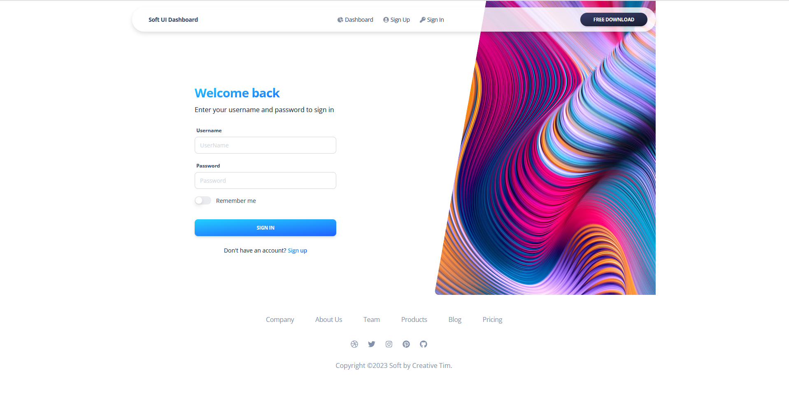
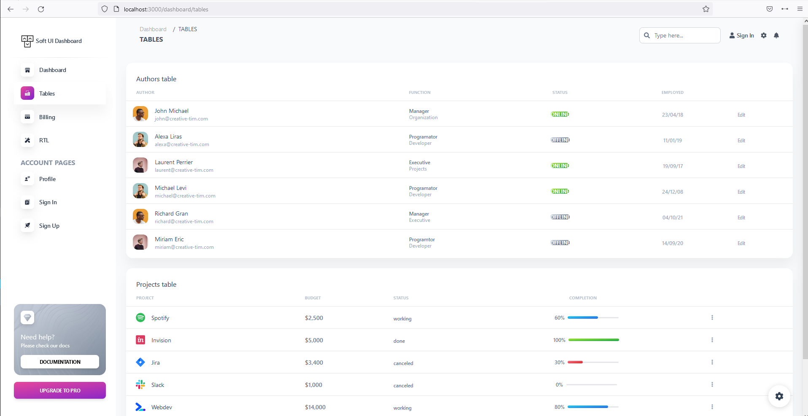

```bash
npm run dev
# or
yarn dev
```

Open [http://localhost:3000](http://localhost:3000) with your browser to see the result.

<div>
    
    
</div>
<br/>
<div>
    
    
</div>
<br/>
<div>
    
    

</div>
    

<br/>
